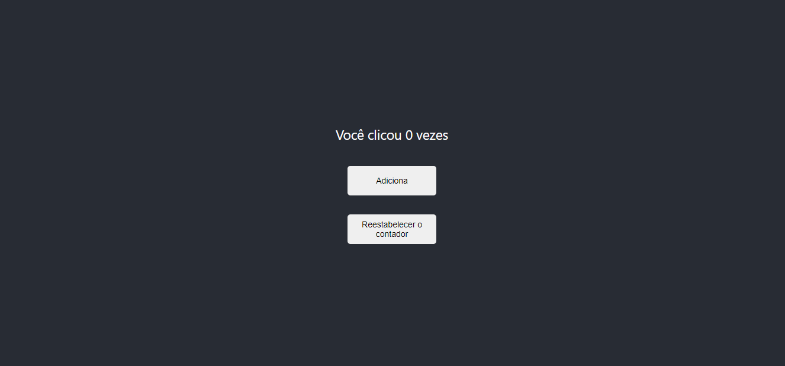

<h1 align="center">
  
</h1>

## App3 - Contador

Este projeto foi inicializado com [Create React App](https://github.com/facebook/create-react-app).

A aplicação é um contador que adiciona 1 cada vez que o botão 'Adiciona' é clicado.

Ao clicar em 'Reestabelecer o contador', o contador voltará a ser 0.

E o título do documento irá ser atualizado de acordo com o contador.

## Scripts disponíveis

No diretório do projeto, você pode rodar os comandos:

### `npm start`

Roda o app no modo de desenvolvimento. 
Abra [http://localhost:3000](http://localhost:3000) para vê-lo no navegador.

A página irá recarregar se você fizer alterações no código 
Você também verá erros de lint (ferramenta de análise de código estática) no console.

### `npm test`

Inicia o executor de teste no modo de observação interativa. 
Veja a seção sobre [running tests](https://facebook.github.io/create-react-app/docs/running-tests) para mais informações.

### `npm run build`

Compila o aplicativo para produção na pasta `build`. 
It correctly bundles React in production mode and optimizes the build for the best performance.

A compilação é minificada e os nomes dos arquivos incluem os hashes. 

Veja a seção sobre [deployment](https://facebook.github.io/create-react-app/docs/deployment) para mais informações.

## Saiba mais

Você pode saber mais sobre na [documentação Create React App](https://facebook.github.io/create-react-app/docs/getting-started).

Para aprender React, confira na [documentação React](https://reactjs.org/).
